# Semaine Mongo DB

## Introduction

Document stocké dans un conteneur JSON sans schéma défini. Information stocké sous champs (objets)
BDD orienté document.

> https://www.mongodb.com/docs/

Possibilité d'imbriquer dans des tableaux. Trsè gros désavantage = informations dupliquées.

## Commandes

use pour creer une nouvelle base de données qui n'existe pas. L'insertion du premier document va creer la base.
"db" est un mot réservé.
la combinaison de db et collection représente un namespace

# Exercices

### Exo 1
Affichez l’identifiant et le nom des salles qui sont des SMAC.
db.salles.find( { smac: true}, { nom: 1, _id:0})

Requête qui sélectionne que les champs avec smac = true.

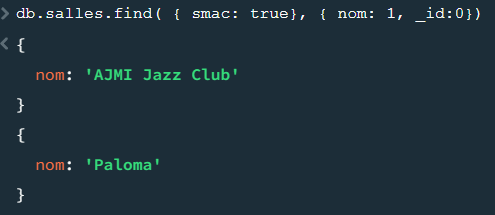

---

### Exo 2
db.salles.find( { capacite : { $gt: 1000}}, { nom: 1, _id:0})
Requête qui montre les salles dont la capacité est supérieure a 1000

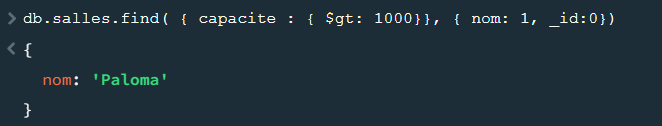

---

### Exo 3
db.salles.find({"adresse.numero": {$exists: false}}, {"nom":1})

Permet de trouver les adresses qui ont un champ numéro vide.


---

### Exo 4
db.salles.find({"avis": {$size: 1}}, {"nom":1})
Permet de trouver les salles qui ont exactement un avis.

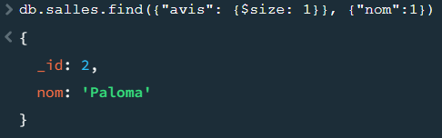

---

### Exo 5
db.salles.find({"styles.": {$eq: "blues"}}, {"styles":1})
Permet de trouver les salles qui programment du blues.

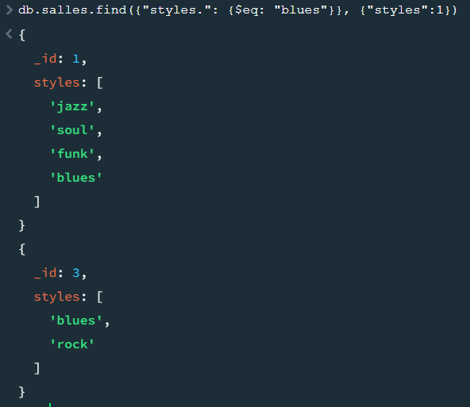

---

### Exo 6
db.salles.find({"styles.0": {$eq: "blues"}}, {"styles":1})
Permet de trouver les salles qui ont en 1ere position dans le tableau styles "blues"

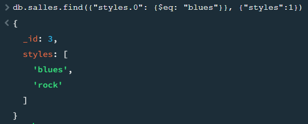

---

### Exo 7 
db.salles.find( { "adresse.codePostal": { "$regex": "^84" }, "capacite": { "$lt": 500 } }, { "adresse.ville": 1 } )

Permet de voir les villes qui ont un code postal commençant par 84 et avec une capacité inférieure a 500

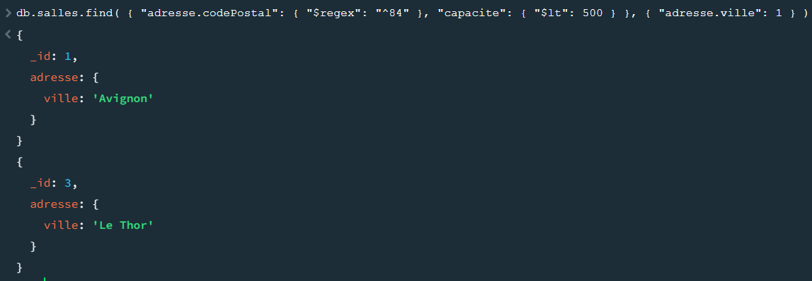

---

### Exo 8

db.salles.find({ $or : [ {"avis": {$exists: false}}, {"_id": {$mod: [2, 0]}}]}, {"nom": 1})
Permet de chercher les salles qui ont un id pair et pas d'avis

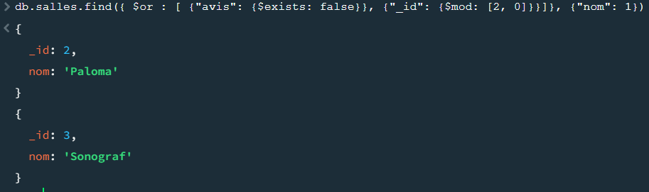

---

### Exo 9
db.salles.find({"avis.note": {$gte :8}, "avis.note": {$lte: 10}}, {"nom": 1})
Permet de trouver les salles dont les avis sont compris entre 8 et 1 inclus

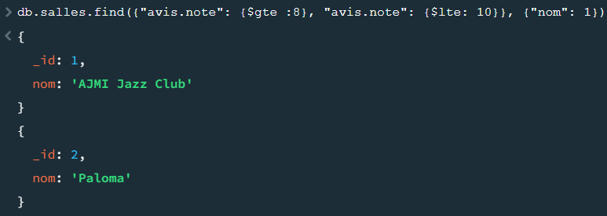

---

### Exo 10
db.salles.find({"avis.date": {$gt: ISODate("2019-11-15")}}, {"nom": 1})

Permet de trouver les salles qui ont un avis datant d'avant le 15 11 2019.

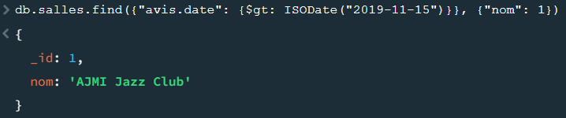

---

### Exo 11
db.salles.find({$expr: {$gt: [{$multiply: ["$_id", 100]}, "$capacite"]}}, {nom: 1, capacite: 1})
Permet d'avoir les salles dont l'id multiplié par 100 est supérieur a la capacité

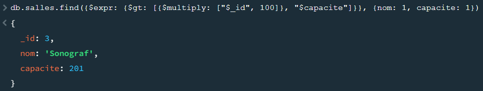

---

### Exo 12
db.salles.find({"type": "smac", "$where": "this.styles?.length > 2"}, {"_id": 0, "nom": 1})

Cette commande devrait marcher mais elle ne retourne aucun resultat (oups)

---

### Exo 13
db.salles.find({}, {"_id": 0, "adresse.codePostal": 1})
Permet d'afficher tout les codes postaux


---

### Exo 14
db.salles.updateMany({}, {$inc: {"capacite": 100}})
Permet d'ajouter 100 a la capacité des salles.

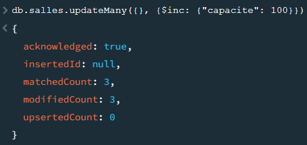

---

### Exo 15
db.salles.updateMany({"styles": {$ne: "jazz"}}, {$push: {"styles": "jazz"}}) 
Permet d'ajouter le style "jazz" a toutes les salles

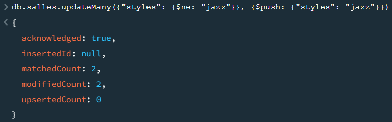

---

### Exo 16
db.salles.updateMany({"_id": {$nin: [2, 3]}, "styles": "funk"}, {$pull: {"styles": "funk"}})
Permet de retirer le style funk aux salles dont l'id n'est ni 2 ni 3

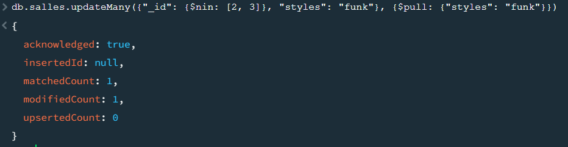

---

### Exo 17
db.salles.updateOne({"_id": 3}, {$addToSet: { "styles": { $each: ["techno", "reggae"] } }})
Permet d'ajouter à la salle avec id 3 les styles techno et reggae.

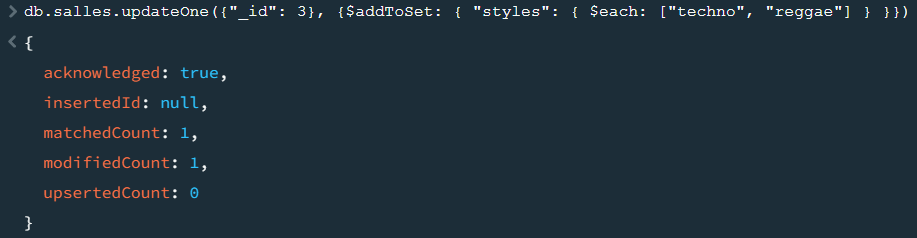

---

### Exo 18

db.salles.updateMany(
    { nom: { $regex: /^p/i } },
      { $inc: { capacite: 150 },
      $push: { contact: {telephone: "04 11 94 00 10"} }
    }
)
Permet d'ajouter aux salles commençant par p majuscule ou minuscule le tableau contact avec le document telephone et la valeur. Augmente la capacité des salles trouvées de 150

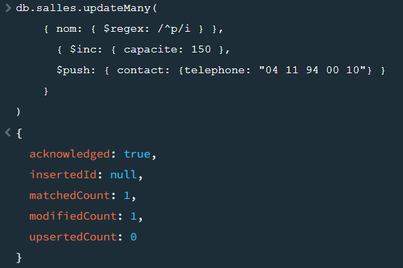

---

### Exo 19
db.salles.updateMany({name: {$regex: "^[aeiou]+$"}}, {$push: {avis: {date: new Date(), note: 10}}});

Permet de trouver les salles commençant par des voyelles et d'ajouter une note de 10 a la date du jour.

---

### Exo 20 

db.collection.updateMany({ name: /^[zZ]/ }, {$set: {name: "Pub Z", capacity: 50, smac: false}}, {upsert: true})

permet de trouver toutes les salles avec un nom commençant par z minuscule ou maj, changer leur nom à "Pub Z", changer leur capacité à 50 et passer smac en false.

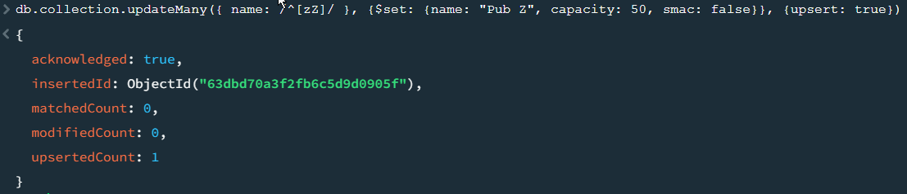

---

### Exo 21
db.collection.aggregate([ {"$group": {"_id": {"$type": "objectId"},"count": {"$sum": 1}}}])

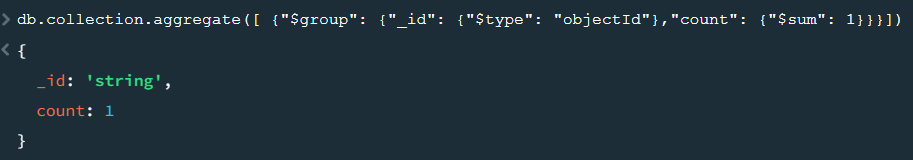

---

### Exo 22

db.salles.find({}, {nom: 1}).sort({capacity: -1}).limit(1).pretty()
Permet d'afficher le nom de la salle ayant la plus grande capacité.

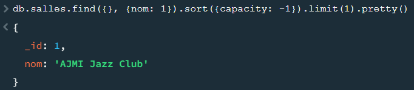

---

### Index.md

On peut créer un index sur les champs capacité et codePostal, on utilise createIndex pour le créer et dropIndex pour le détruire
db.salles.createIndex({ "capacite": 1, "adresse.codePostal": 1 })
db.salles.dropIndex({ "capacite": 1, "adresse.codePostal": 1 })

### Validation.md

Exercice 1

La tentative d'insertion retourne une erreur car le champ codePostal est obligatoire et n'a pas été spécifié. Pour corriger ça il faut ajouter le camp code postal et le renseigner avec une valeur valide

```
db.salles.insertOne( 
{"nom": "Super salle", "capacite": 1500, "adresse": {"codePostal": "12345", "ville": "Musiqueville"}} 
)
```
---

# Lexique

Document : ensemble de données clé => valeur, très proche du js.

Schéma : il est dynamique

Collection : permet de stocker des documents de manière logique comme une table. schéma adaptable.
