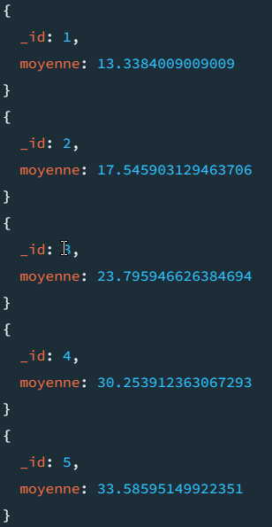
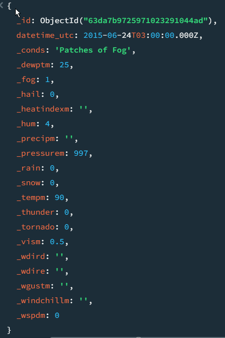

# Weather TP

Voici mon script c# permettant de convertir un fichier CSV en JSON
```
using System.Text;

namespace CsvToJson
{
    class Program
    {
        static void Main(string[] args)
        {
            var csvFile = File.ReadAllLines(@"C:\Users\Maxime\Downloads\archive\testset.csv");
            var columnNames = csvFile[0].Split(',');
            var jsonFile = new StringBuilder();
            jsonFile.Append("[");
            for (int i = 1; i < csvFile.Length; i++)
            {
                jsonFile.Append("{");
                var rowData = csvFile[i].Split(',');
                for (int j = 0; j < columnNames.Length; j++)
                {
                    jsonFile.Append("\"" + columnNames[j] + "\":\"" + rowData[j] + "\",");
                }
                jsonFile.Remove(jsonFile.Length - 1, 1);
                jsonFile.Append("},");
            }
            jsonFile.Remove(jsonFile.Length - 1, 1);
            jsonFile.Append("]");
            File.WriteAllText(@"C:\Users\Maxime\Downloads\test.json", jsonFile.ToString());
        }
    }
}
```
Le script n'ayant pas permis de cast du type string à int les informations nécessaires j'ai décidé de faire un mongoimport directement.

Pour ce faire, il suffit d'installer mongodb tools, de le placer dans le dossier root. 
Il faut ensuite placer le fichier csv dans le même dossier. Ensuite en ouvrant une invite de commande, j'ai utilisé la commande 
```
mongoimport -d weatherTP -c delhi --type csv --file testset.csv --headerline  
```
Cette dernière a créé mon document dans ma base weatherTP et a importé les données du testset.csv en récupérant les noms de colonnes.

Le jeu de données a été téléchargé sur Kaggle.com. Il représente les données météo de la ville de New Delhi

Pour ajouter un index j'ai utilisé la commande

db.collection.createIndex({datetime_utc: 1})

Pour récupérer les index j'ai utilisé la commande getIndexes()

.png)


Pour trouver toutes les stations dont la température a été supérieure à 25° entre les mois de juin et aout j'ai utilisé la commande:

```
db.delhi.find( { _tempm: { $gt: 25 }, datetime_utc: { $gte: ISODate('1996-06-01T00:00:00.000+00:00'), $lte: ISODate('2023-08-31T23:59:59.000+00:00') } } )
```
On peut rajouter ``` .sort({ _pressurem: -1 }) ``` afin de trier les stations par la pression atmosphérique dans l'ordre décroissant

ou utiliser ``` db.delhi.find().sort({_pressurem:-1}) ``` pour trier tous les documents.

Afin d'avoir une moyenne des températures par mois j'ai utilisé la commande : 

``` 
db.delhi.aggregate([
   {
      $match: {
         $expr: {
            $in: [
               {$month: "$datetime_utc"},
               [1, 2, 3, 4, 5, 6, 7, 8, 9, 10, 11, 12]
            ]
         }
      }
   },
   {
      $group: {
         _id: { $month: "$datetime_utc" },
         moyenne: {$avg: "$_tempm"}
      }
   }
]).sort({"_id":1})
```
Qui nous donne les résultats suivants :



Afin de récuperer la station météorologique qui a enregistré la plus haute température en été j'ai utilisé la commande suivante : 

``` 
db.collection.aggregate([
    {
        $match: {
            datetime_utc: {
                $gte: ISODate("1996-06-01T00:00:00Z"),
                $lte: ISODate("2023-09-30T23:59:59Z")
            }
        }
    },
    {
        $group: {
            _id: null,
            highest_temp: { $max: "$_tempm" }
        }
    },
    {
        $project: {
            _id: 0,
            highest_temp: 1
        }
    }
])
```
Elle permet de récupérer les stations avec une température enregistrée, de sélectionner la plus haute et d'en afficher une seule.



